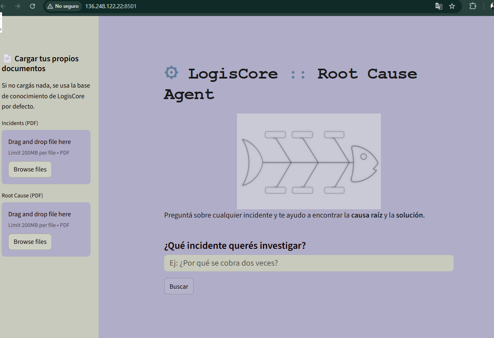
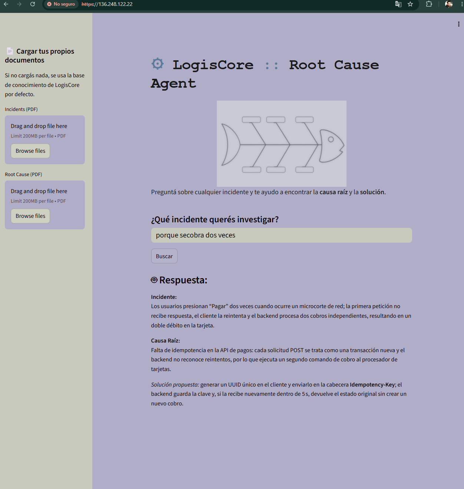
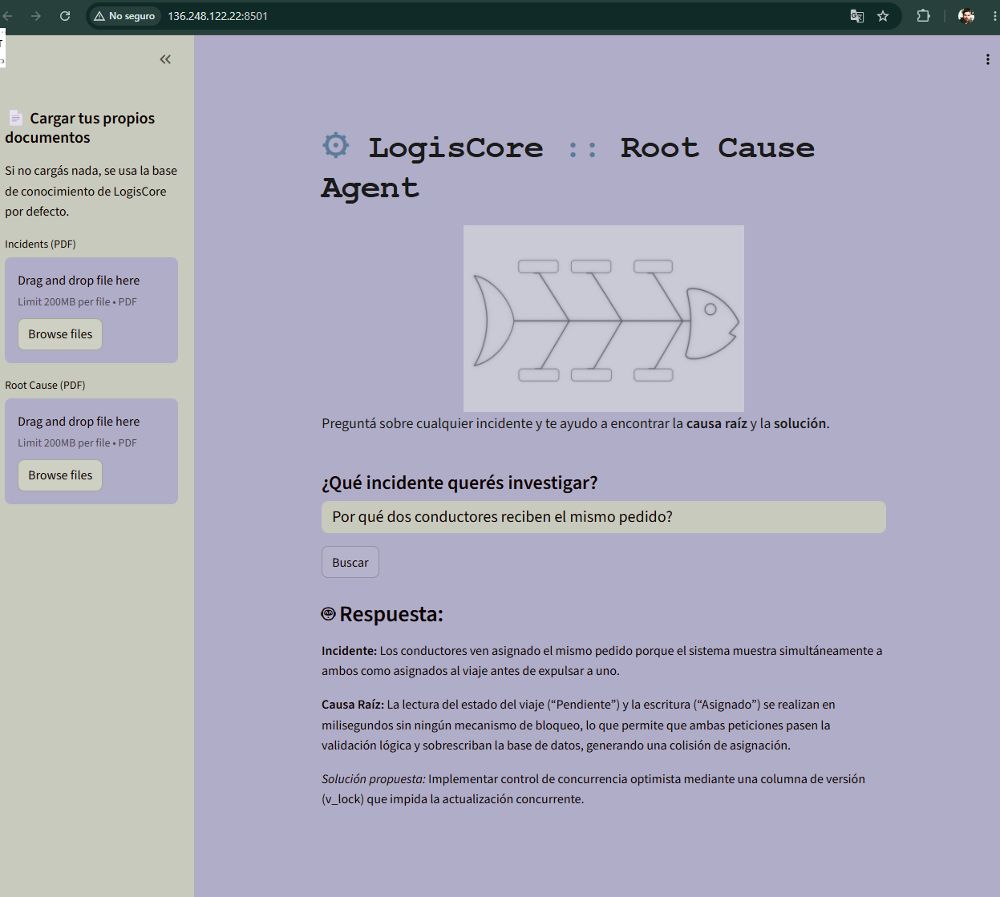

# LogisCore :: Root Cause Agent

## Descripción del proyecto

**LogisCore** es una plataforma sintética de despacho logístico automatizado (gestión de flotas, enrutamiento y asignación de entregas). Como todo sistema en producción, presenta incidentes recurrentes que afectan la operación diaria.

Los **trabajadores del equipo de software de LogisCore** necesitan, ante cada incidente reportado, identificar rápidamente **cuál es su causa raíz técnica** y **cómo resolverlo** — sin tener que revisar manualmente la documentación completa cada vez.

Este proyecto es un **agente de inteligencia artificial** que resuelve exactamente ese problema: el trabajador le pregunta al agente en lenguaje natural sobre un incidente (por ejemplo, *"¿por qué se cobra dos veces a los clientes?"*), y el agente responde cruzando información de **dos documentos**:

1. **Reporte de Incidentes** (los síntomas/fallas reportadas por usuarios y conductores)
2. **Análisis de Causa Raíz** (el diagnóstico técnico y la solución propuesta para cada incidente)

El agente identifica el incidente correspondiente, explica su **causa raíz técnica**, y entrega la **solución propuesta** — todo basado únicamente en la documentación real, sin inventar información que no esté presente en los documentos.

## Arquitectura

El flujo del sistema sigue un patrón **RAG (Retrieval-Augmented Generation)**:

```
┌───────────────────┐     ┌───────────────────┐       ┌─────────────── ────┐
│  PDF Incidentes   │     │  PDF Causa Raíz   │       │  Usuario (input)   │
└─────────┬─────────┘     └────────┬──────────┘       └─────────┬──────────┘
          │                        │                            │
          └────────────┬───────────┘                            │
                       ▼                                        │
              ┌────────────────────┐                            │
              │  Carga y chunking  │                            │
              │      (rag.py)      │                            │
              └──────────┬─────────┘                            
                         ▼                                      │
              ┌────────────────────┐                            │
              │  Embeddings Cohere │                            │
              └──────────┬─────────┘                            │
                         ▼                                      │
              ┌───────────────── ───┐                           │
              │  Índice Pinecone    │◄───────────  ─────────────┘
              │   (vector store)    │      (busca contexto relevante)
              └──────────┬──────────┘
                         ▼
              ┌────────────────────┐
              │  Retriever (k=4)   │
              │     (tools.py)     │
              └──────────┬─────────┘
                         ▼
              ┌────────────────────┐
              │  Prompt Template   │
              │  + LLM Groq (LCEL) │
              │     (agente.py)    │
              └──────────┬─────────┘
                         ▼
              ┌────────────────────┐
              │  Respuesta final:  │
              │  Incidente +       │
              │  Causa Raíz +      │
              │  Solución          │
              └──────────┬─────────┘
                         ▼
              ┌────────────────────┐
              │ Interfaz Streamlit │
              │      (app.py)      │
              └────────────────────┘
```

## Tecnologías utilizadas

| Componente | Tecnología |
|---|---|
| Lenguaje | Python 3.12 |
| Framework de orquestación | LangChain (LCEL) |
| Embeddings | Cohere (`embed-multilingual-v3.0`) |
| Base de datos vectorial | Pinecone |
| LLM (modelo de lenguaje) | Groq (`llama-3.1-8b-instant`) |
| Carga y procesamiento de PDF | PyPDFLoader + RecursiveCharacterTextSplitter |
| Interfaz web | Streamlit |
| Control de versiones | Git + GitHub |
| Despliegue | Streamlit Community Cloud / Oracle Cloud Infrastructure (OCI) |

## Instrucciones de instalación

### 1. Clonar el repositorio
```bash
git clone https://github.com/technobonal/AgentRootCauseByFranklinBonalde.git
cd AgentRootCauseByFranklinBonalde
```

### 2. Crear y activar el entorno virtual
```bash
python -m venv venv
venv\Scripts\activate
```

### 3. Instalar dependencias
```bash
pip install -r requirements.txt
```

### 4. Configurar variables de entorno
Crear un archivo `.env` en la raíz del proyecto:
```env
GROQ_API_KEY=tu_clave
COHERE_API_KEY=tu_clave
PINECONE_API_KEY=tu_clave
```

### 5. Cargar los documentos al índice de Pinecone (solo la primera vez)
```bash
python rag.py
```

### 6. Correr la aplicación
```bash
streamlit run app.py
```

## Ejemplos de preguntas y respuestas

### Pregunta 1
**Usuario:** ¿Por qué dos conductores reciben el mismo pedido?

**Agente:**
> **Incidente:** "Desasignación Fantasma" — dos conductores aparecen asignados al mismo pedido porque ambos aceptan la solicitud casi simultáneamente.
> **Causa Raíz:** La lectura del estado del viaje ("Pendiente") y la escritura ("Asignado") se realizan en milisegundos sin ningún mecanismo de bloqueo, de modo que ambas peticiones pasan la validación lógica del backend y sobrescriben la base de datos, generando una condición de carrera.
> **Solución propuesta:** Implementar control de concurrencia optimista añadiendo una columna de versión (`v_lock`) y verificando su valor en el `UPDATE` para rechazar la segunda aceptación.

---

### Pregunta 2
**Usuario:** ¿Por qué se congela el rastreo los viernes?

**Agente:**
> **Incidente:** Congelamiento del rastreo y error 503 los viernes entre 18:00 y 20:00, cuando el mapa en vivo deja de actualizarse y el Dashboard muestra una pantalla en blanco.
> **Causa Raíz:** Agotamiento del pool de conexiones y fuga de WebSockets: las aplicaciones cliente mantienen conexiones permanentes que no se cierran al cerrar la app, saturando los hilos y alcanzando el límite máximo de conexiones, lo que provoca timeouts de base de datos y el error 503.
> **Solución propuesta:** Implementar un heartbeat (Ping/Pong) cada 30 segundos para cerrar sockets inactivos, y desacoplar las lecturas SQL mediante un caché en memoria (por ejemplo, Redis Pub/Sub).

---

### Pregunta 3
**Usuario:** ¿Por qué a los clientes se les cobra dos veces?

**Agente:**
> **Incidente:** Los clientes reciben un doble cobro cuando, tras perder la señal de internet al presionar "Pagar", la aplicación reintenta la solicitud y el backend procesa dos transacciones independientes.
> **Causa Raíz:** La API de pagos no implementa idempotencia; cada petición POST se trata como una nueva operación financiera, por lo que el reintento genera un segundo cargo al procesador de tarjetas.
> **Solución propuesta:** Generar y enviar un `Idempotency-Key` (UUID) desde el cliente para que el backend reconozca y descarte peticiones duplicadas.

---

### Pregunta fuera del alcance de los documentos (control de alucinación)
**Usuario:** ¿Qué incidente afecta al sistema de facturación electrónica?

**Agente:**
> No encuentro esa información en la documentación disponible.

## Uso de Git

Comandos utilizados a lo largo del desarrollo del proyecto:

```bash
# Ver estado de archivos modificados
git status

# Agregar archivos al staging
git add .
git add archivo_especifico.py

# Registrar un commit
git commit -m "mensaje descriptivo del cambio"

# Conectar el repositorio local con GitHub
git remote add origin https://github.com/technobonal/AgentRootCauseByFranklinBonalde.git

# Verificar el repositorio remoto conectado
git remote -v

# Subir el historial de commits a GitHub
git push -u origin master

# Ver el historial de commits
git log --oneline

# Configurar identidad del autor de los commits
git config user.name 
git config user.email 
```

## Historial de commits

| Commit | Descripción |
|---|---|
| `74d6f9b` | Initial project setup with .gitignore and reference PDFs |
| `95d5d07` | Add requirements.txt with project dependencies |
| `6f2ec20` | Update requirements.txt with langchain, groq, pinecone, huggingface and streamlit dependencies |
| `52578ea` | Agrego archivos del agente, app principal, rag y tools |
| `1c977d7` | Implemento carga de PDFs, embeddings de Cohere y conexión a Pinecone en rag.py |
| `6c2e76c` | Implemento pipeline completo: retriever en rag.py, búsqueda en tools.py y agente con prompt template para RCA en agente.py |
| — | Ajuste de `k` en retriever tras pruebas de rendimiento y precisión |
| — | Refactorización de agente.py usando LCEL (LangChain Expression Language) |
| — | Agrego cache_resource en tools.py para optimizar carga del retriever en Streamlit |
| — | Agrego uploaders laterales, estilo tecnológico al título, imagen fishbone y ajustes de tema |
| — | Agrego README con documentación del proyecto |

## Despliegue

### Streamlit Community Cloud
La aplicación se encuentra desplegada y disponible públicamente en:
👉 [agentrootcausebyfranklinbonalde-5zkiunymzjan4qxk5nmwsc.streamlit.app](https://agentrootcausebyfranklinbonalde-5zkiunymzjan4qxk5nmwsc.streamlit.app/)

### Oracle Cloud Infrastructure (OCI)
## 🚀 Despliegue en Oracle Cloud Infrastructure (OCI)

Además del despliegue en Streamlit Community Cloud, este proyecto está desplegado en una instancia propia de OCI, con Nginx como reverse proxy y HTTPS habilitado.

### Arquitectura del despliegue
- **Instancia:** VM.Standard.E3.Flex — Oracle Linux 9.7
- **Región:** sa-saopaulo-1
- **Reverse proxy:** Nginx con certificado SSL autofirmado
- **Backend:** Streamlit en el puerto 8501, expuesto vía proxy en el 443
- **Seguridad:** SELinux (`httpd_can_network_connect`) + firewall del SO + Security List de OCI

### Vista de la aplicación



### Acceso vía HTTPS con Nginx

El tráfico se sirve a través de Nginx con certificado SSL autofirmado en el puerto 443:



> ⚠️ El certificado es autofirmado, por lo que el navegador muestra una advertencia de conexión no segura. Es el comportamiento esperado en este entorno.

### Ejemplo de análisis de causa raíz



El agente identifica la causa raíz — en este caso, una condición de carrera por falta de control de concurrencia — y propone una solución concreta, como el uso de una columna de bloqueo optimista (`v_lock`).

## Autor

Franklin Bonalde
